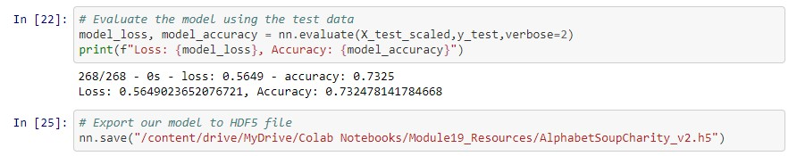

# Neural_Network_Charity_Analysis
## Overview
Using knowledge of Pandas and the Scikit-Learn’s StandardScaler(), the purpose of this analysis was to employ deep learning models in to aid a fictitious company named AlphabetSoup, a philanthropic organization dedicated to donating funds to organizations whose goals it deemed worthwhile, in vetting donation applicants. By training a deep learning model on a retrospective dataset of about 30,000 historical donations for both successful and unsuccessful outcomes, the model served as a binary classifier to predict whether applicants would be successful if given funding. In short, this would help AlphabetSoup know where to place their money.

The deep learning model performed supervised learning by training on the "feature" columns from the dataset to predict a "target" column containing binary values of "0" or "1", as these numbers were indicative of whether the donation of each observation produced an unsuccessful or successful outcome, respectively. To optimize the performance and prepare it for the neural network model, the data required significant preprocessing. Following this, the data was compiled, trained, and the results were evaluated. The details and results of this process are described further below.

